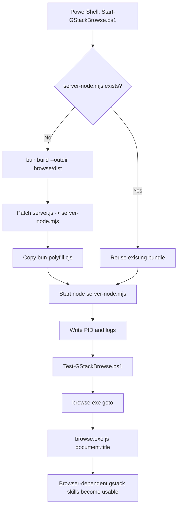

# GStack Windows Browse Workaround

This helper set is for the current machine:

- `Windows`
- `Codex App`
- `gstack` installed at `C:\Users\Administrator\gstack`

It does not modify `gstack` source files.

It only does two things:

1. If `C:\Users\Administrator\gstack\browse\dist\server-node.mjs` is missing, it rebuilds the Windows Node bundle with the validated local workaround.
2. It gives you PowerShell commands to start, stop, and test the `gstack` browser daemon.

## Default Paths On This Machine

- `gstack` root: `C:\Users\Administrator\gstack`
- Codex skills: `C:\Users\Administrator\.codex\skills`
- Helper scripts: `I:\OpenCode\aigenerateAdvanture\gstack-windows`

## Files

- `Start-GStackBrowse.ps1`
  - checks `~/gstack`
  - rebuilds `browse/dist/server-node.mjs` if needed
  - starts the background Node server
  - writes PID, logs, and runtime metadata
- `Stop-GStackBrowse.ps1`
  - stops the background Node server
  - clears local PID and metadata files
- `Test-GStackBrowse.ps1`
  - makes sure the server is running
  - runs `browse.exe goto https://example.com`
  - runs `browse.exe js "document.title"`
  - writes the result to `runtime/last-test.json`
- `browse-workaround.mmd`
  - Mermaid source for the workaround flow

## Common Commands

Enter the project in PowerShell:

```powershell
cd I:\OpenCode\aigenerateAdvanture
```

Start the browser daemon:

```powershell
.\gstack-windows\Start-GStackBrowse.ps1
```

Stop the browser daemon:

```powershell
.\gstack-windows\Stop-GStackBrowse.ps1
```

Run a minimal verification:

```powershell
.\gstack-windows\Test-GStackBrowse.ps1
```

Force a rebuild and restart:

```powershell
.\gstack-windows\Start-GStackBrowse.ps1 -ForceRebuild -ForceRestart
```

Run the server in the foreground:

```powershell
.\gstack-windows\Start-GStackBrowse.ps1 -Foreground
```

## Runtime Artifacts

The scripts write runtime data to `gstack-windows/runtime/`:

- `gstack-browse.pid`
- `gstack-browse.meta.json`
- `gstack-browse.stdout.log`
- `gstack-browse.stderr.log`
- `last-test.json`

## Skills That Depend On The Browser Daemon

Start the daemon first before using these skills:

- `gstack-browse`
- `gstack-qa`
- `gstack-qa-only`
- `gstack-open-gstack-browser`
- `gstack-benchmark`
- `gstack-canary`
- `gstack-pair-agent`
- `gstack-setup-browser-cookies`

## Skills That Mostly Do Not Depend On It

These are mostly planning, review, or workflow skills:

- `gstack-review`
- `gstack-ship`
- `gstack-office-hours`
- `gstack-plan-*`
- `gstack-retro`
- `gstack-careful`
- `gstack-freeze`
- `gstack-guard`

## Known Limits

- This workaround does not patch `gstack` source, but it does generate runtime artifacts inside `C:\Users\Administrator\gstack\browse\dist`.
- It fixes the missing `server-node.mjs` problem. It does not guarantee that every Windows browser command is fully stable.
- If you see `Starting server...` or `Another instance is starting the server...`, run:

```powershell
.\gstack-windows\Stop-GStackBrowse.ps1
.\gstack-windows\Start-GStackBrowse.ps1 -ForceRestart
```

- After the official Windows build fix lands upstream, you can rerun the official upgrade/install flow and decide whether to keep this local workaround.

## Mermaid

Mermaid source:

- `I:\OpenCode\aigenerateAdvanture\gstack-windows\browse-workaround.mmd`

Embedded diagram:


